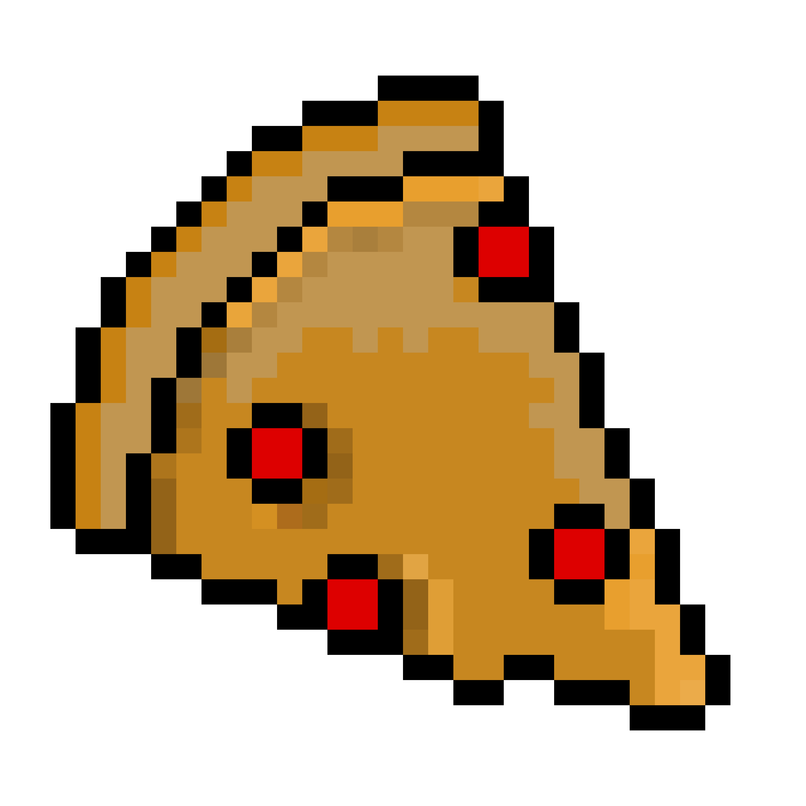
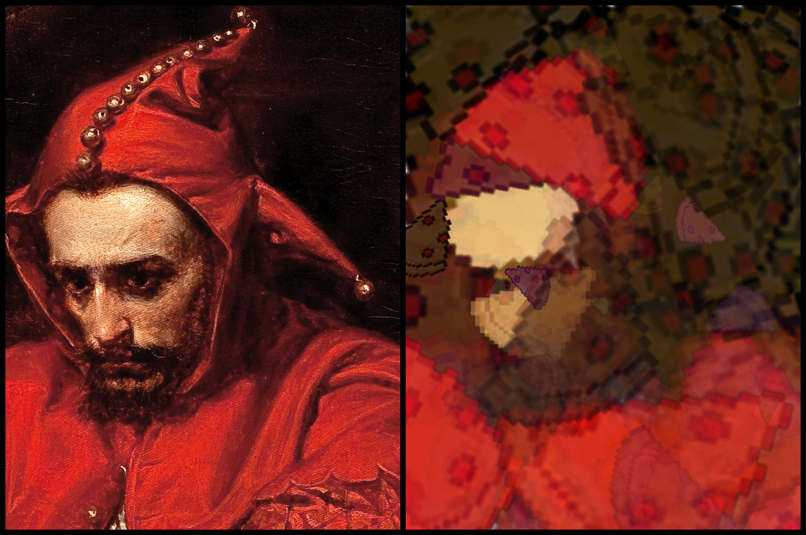

# evolution-photos

 

  

  <h3 align="center">Evolutionary Created Images</h3>

  

    Replicating photos using genetic algorithm one pizza at the time!
  

## About The Project

Replicating photos with other graphics, using evolutionary algorithms.

### Built With
    * Python
    * NumPy
    * Pillow
    * Evolution Algorithms

## Contact

[LinkedIn](https://www.linkedin.com/in/borys-langowicz/)
[GitHub](https://github.com/neloduka-sobe)

## LICENSE
MIT License

Copyright (c) 2024 Borys Łangowicz

## Acknowledgements:
* Original idea from [Roger Johansson Blog](https://rogerjohansson.blog/): [Post Link](https://rogerjohansson.blog/2008/12/07/genetic-programming-evolution-of-mona-lisa/)
* Seen from Gynvael Coldwind: [Mona Lisa in 100000 iterations](https://www.youtube.com/watch?v=ACjtE5zyihE)
* image.png by Jan Matejko [Wikipedia](https://en.wikipedia.org/wiki/Sta%C5%84czyk_(painting))
* [Sprite](https://mts1944.itch.io/pizza) by [MTS1944](mts1944.itch.io)
* [README](https://github.com/othneildrew/Best-README-Template)
